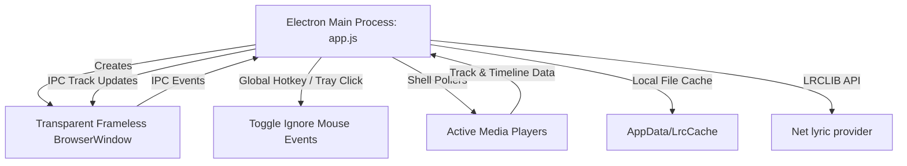

# 🛠️ Technical Specification: NanoLyrics

This document details the software architecture, behavior patterns, API integrations, and code components of the **NanoLyrics** desktop widget.

---

## 1. Architectural Overview

NanoLyrics is structured as a **single-file Electron application** for maximum portability, ease of compilation, and low resource footprint. The core application logic resides in `app.js`, which dynamically compiles, configures, and serves the user interface.



---

## 2. Window Transparency & Click-Through Protocol

To ensure a seamless aesthetic that does not obstruct background windows, NanoLyrics operates under two distinct window modes:

### A. Playback Mode (Default Locked State)
- **Visuals**: Frameless, completely transparent window background (`transparent: true`, `frame: false`).
- **Interactions**: Click-through is enabled using:
  ```javascript
  win.setIgnoreMouseEvents(true, { forwardToHTML: true });
  ```
  This permits mouse clicks, scrolls, and drag motions to pass straight through the lyric overlay onto background applications. Only specific DOM elements (like a tiny settings cog if hovered, or no elements at all) handle hovering events.

### B. Edit & Position Mode (Unlocked Configuration State)
- **Activation**: Triggered by hitting the global hotkey (`Ctrl+Shift+L` or `Cmd+Shift+L` on macOS) or by clicking the system tray icon.
- **Visuals**: A translucent dark overlay (`rgba(0, 0, 0, 0.65)`) sweeps across the widget, revealing boundary outlines, resizing corners, and configuration panels.
- **Interactions**: Click-through is completely disabled:
  ```javascript
  win.setIgnoreMouseEvents(false);
  ```
  The user is free to drag the widget, resize it via window edges, type into input fields, and adjust configuration settings (such as customizing the `.lrc` cache path).

---

## 3. Zero-Dependency Media Monitoring System

To bypass complex, platform-dependent native C++ libraries (which commonly break during Node upgrades and cross-platform compilation), NanoLyrics implements lightweight background system-level subprocess calls to check active media players.

### Subprocess Strategies by OS:

#### 1. Windows (10/11)
Queries the **Windows Runtime System Media Transport Controls (SMTC)** using standard PowerShell (no administrator privileges needed):
```powershell
[Windows.Media.Control.GlobalSystemMediaTransportControlsSessionManager, Windows.Media.Control, ContentType=WindowsRuntime] | Out-Null
$mgr = [Windows.Media.Control.GlobalSystemMediaTransportControlsSessionManager]::RequestAsync().GetAwaiter().GetResult()
$session = $mgr.GetCurrentSession()
if ($session) {
    $info = $session.TryGetMediaPropertiesAsync().GetAwaiter().GetResult()
    $timeline = $session.GetTimelineProperties()
    [PSCustomObject]@{
        Title = $info.Title
        Artist = $info.Artist
        Position = $timeline.Position.TotalSeconds
        Status = $session.GetPlaybackInfo().PlaybackStatus.ToString()
    } | ConvertTo-Json -Compress
}
```

#### 2. macOS
Executes a quick **AppleScript** command to interface with running audio applications (Spotify & Apple Music):
```applescript
tell application "System Events"
    if exists (process "Spotify") then
        tell application "Spotify"
            return "{\"Artist\":\"" & artist of current track & "\",\"Title\":\"" & name of current track & "\",\"Position\":" & player position & ",\"Status\":\"" & player state & "\"}"
        end tell
    else if exists (process "Music") then
        tell application "Music"
            return "{\"Artist\":\"" & artist of current track & "\",\"Title\":\"" & name of current track & "\",\"Position\":" & player position & ",\"Status\":\"" & player state & "\"}"
        end tell
    end if
end tell
```

#### 3. Linux
Queries media streams via `dbus-send` targeting the MPRIS protocol:
```bash
dbus-send --print-reply --dest=org.mpris.MediaPlayer2.spotify /org/mpris/MediaPlayer2 org.freedesktop.DBus.Properties.Get string:'org.mpris.MediaPlayer2.Player' string:'PlaybackStatus'
```

### Timeline Drift Correction & Simulation Fallback
If the underlying media player fails to provide timeline progress updates, or if the update rate is slow:
1. On **Track Transition Detection** (e.g. metadata title or artist changes), the internal millisecond timeline resets to `0.0`.
2. A high-accuracy local timer ticks up continuously:
   $$\text{CurrentTime} = \text{InitialPosition} + (t_{\text{now}} - t_{\text{last\_update}})$$
3. As soon as a fresh real progress timeline update arrives from the OS, the local timeline synchronizes, self-correcting any drift seamless to the user.

---

## 4. LRCLIB API & Lyric Parser

### A. LRC Fetch Workflow
1. The media monitor extracts the playing `Artist` and `Title`.
2. NanoLyrics checks the **Local LRC Cache** (e.g. `%APPDATA%/NanoLyrics/LrcCache/Artist - Title.lrc`). If present, it loads instantly.
3. If not found in the local cache, the app requests the **LRCLIB API**:
   - Primary: `GET https://lrclib.net/api/get?artist={Artist}&track={Title}`
   - Fallback Search: `GET https://lrclib.net/api/search?q={Artist} {Title}`
4. If a synced LRC block exists, the app writes it into the local cache directory and broadcasts the parsed lines to the Renderer window.

### B. LRC Parsing Algorithm
LRC files match the format `[minutes:seconds.hundredths] Lyric line text`.
1. The parser splits lines by linebreaks.
2. For each line, it scans for time tags using the regular expression `\[(\d+):(\d+)(?:\.(\d+))?\]`.
3. It converts the matched hours, minutes, seconds, and milliseconds into total seconds:
   $$\text{TotalSeconds} = (\text{Minutes} \times 60) + \text{Seconds} + \frac{\text{Milliseconds}}{100}$$
4. It compiles a sorted list of objects:
   ```json
   [
     { "time": 12.45, "text": "This is the first lyric line." },
     { "time": 15.80, "text": "This is the second line." }
   ]
   ```
5. The renderer keeps track of the active line by finding the largest index $i$ such that $\text{TotalSeconds}_{\text{player}} \geq \text{time}_i$.

---

## 5. Storage, Configuration & Cross-Platform Compilations

- **User Preferences**: Saved to `%USERPROFILE%/AppData/Roaming/NanoLyrics/config.json` (Windows) or `~/.config/NanoLyrics/config.json` (Linux/macOS). Holds options for font family, sizes, transparency levels, colors, and custom LRC storage path.
- **Packaging/Compilation**: Can be packaged into highly-compressed stand-alone binaries without external requirements using `electron-builder` or `electron-packer`.
